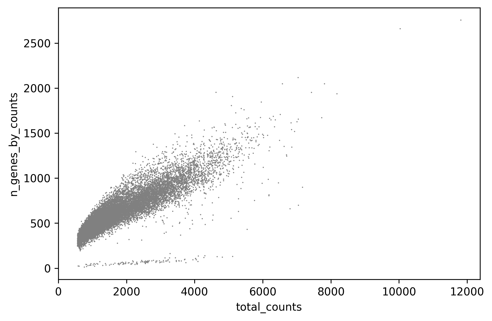
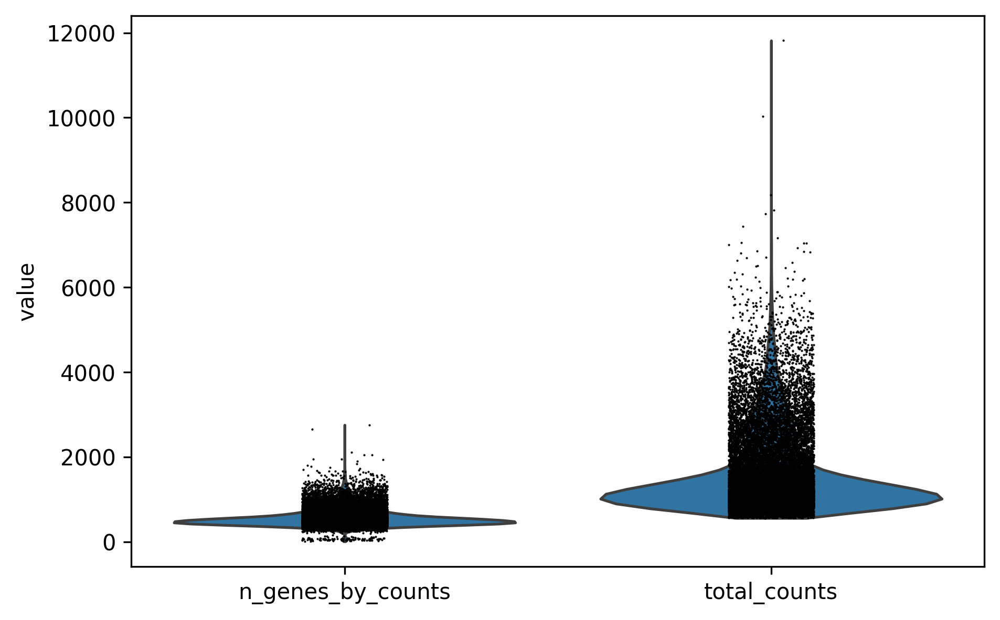
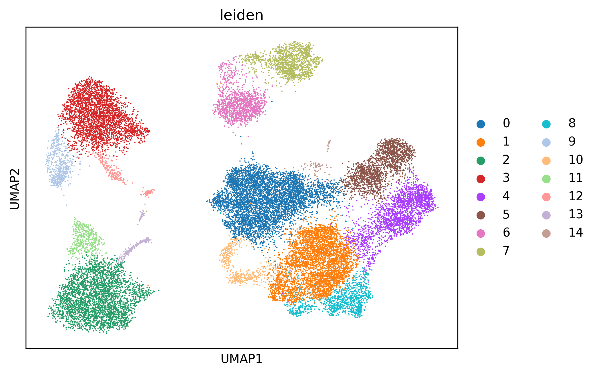

# Analysis Report

## Executive Summary
The single-cell RNA sequencing (scRNA-seq) analysis pipeline successfully completed all core steps: data loading, preprocessing and quality control (QC), dimensionality reduction (PCA), clustering (Leiden algorithm), and visualization (UMAP). The process concluded with the generation of key QC plots and a cluster map. A minor warning regarding the future default backend for Leiden clustering was issued but does not affect the current results.

## Key Results
- **Data loading** was completed without errors.
- **Preprocessing and QC** were applied successfully, filtering out low-quality cells based on standard metrics (e.g., number of genes, mitochondrial gene percentage).
- **Dimensionality reduction** via PCA and UMAP revealed distinct cell populations.
- **Clustering** using the Leiden algorithm identified cellular subpopulations at a resolution of 0.5.
- All outputs—including visualizations—were saved to the output directory as expected.

## Visualizations

### QC Scatter Plot
  
This plot typically displays each cell as a point, with axes representing common QC metrics such as total counts (log-transformed) vs. number of detected genes or percentage of mitochondrial reads. It helps identify outliers or poor-quality cells that may need removal. Clusters of cells with high mitochondrial content or low gene counts are often indicative of dead or damaged cells.

### QC Violin Plot
  
This plot shows the distribution of key QC metrics (e.g., number of genes per cell, total counts, mitochondrial percentage) across cells, often colored by cluster or sample. It enables assessment of batch effects and ensures that QC thresholds are appropriately set without removing biologically relevant populations.

### UMAP Cluster Visualization
  
The UMAP plot visualizes high-dimensional gene expression data in two dimensions, coloring cells by their assigned clusters. This figure illustrates the overall structure of the dataset, showing potential cell types or states and the degree of separation between them. It serves as a primary tool for exploratory analysis and hypothesis generation.

## Conclusion
The quality control and downstream analysis pipeline executed successfully, producing meaningful visualizations that support further biological interpretation. The QC steps appear effective in identifying and excluding low-quality cells, and the clustering reveals a clear organization of cell populations. The analysis is ready for downstream differential expression or marker identification.

## Next Steps suggestion
```json
[
  "Perform differential expression analysis between identified clusters to identify potential cell type markers.",
  "Annotate clusters using known marker genes from literature or reference datasets (e.g., CellMarker, Human Cell Atlas).",
  "Explore batch effects or technical confounders by integrating sample origin or experimental conditions into the UMAP/cluster analysis."
]
```